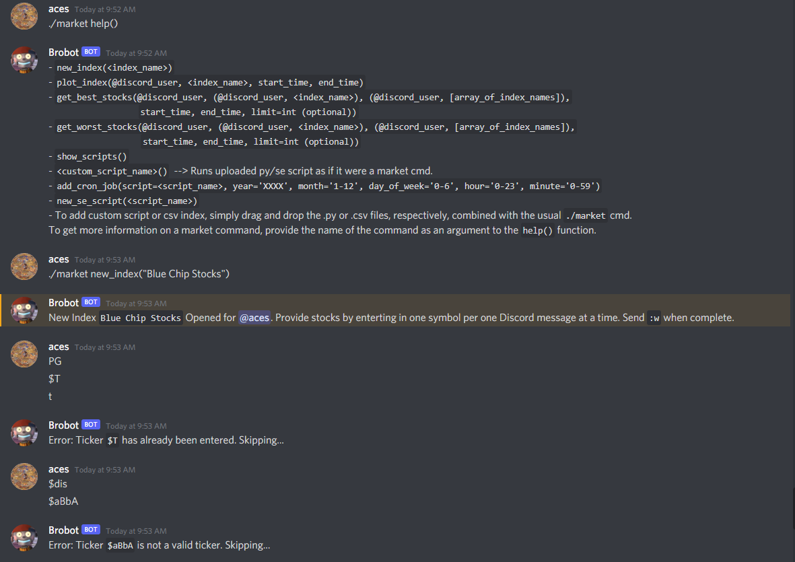

# MarketBehaviorSet

A Stock Market BehaviorSet (Discord Bot) to be ran by the [DiscordBotRunner](https://github.com/collinharmon/DiscordBotRunner).

## Description

A Discord Stock Market API to facilitate technical analysis, promote social discussion, and to provide Discord users the ability to utilize Market API functionality through Discord.

The initial motive for this project was to allow my friends in our Discord Guild to be able to make custom indexes composed of their favorite stocks which can then be shared with other Discord users. That way if an individual seeks new stocks to purchase, he or she can look at what their friends are holding and then obtain stock data and charts for technical analysis. 

This idea lead to the development of a full-fledged Discord Stock Market API wherein each Discord user can utilize the Market API's full functionality through Discord Channels. This functionality ranges from querying Real-Time Stock Market Data (through Alpaca API), requesting charts/graphs on Market Data (with help from `matplotlib`), creation of custom indexes/portfolios, writing and uploading custom Python/Stock Market Scripts (which becomes accessible to every Discord user to run), scheduling cron jobs etc. 

I truly wanted to provide each Discord user the ability to make full use of the Stock Market API through Discord channels (and in turn their phones or any other devices which can access Discord). Allowing for Discord users to upload and run their own custom Python Scripts (wherein the scripts have access to the underlying Market API object) realizes this ability. Considering not everyone has Python or programming experience, I overlaid a "Simple" API on top of the Market API which non-programmers can intuitively use to obtain meaningful Stock Market data and graphs (see Market Commands below). Scripts can be written and uploaded which run these simplified Market Commands (see .se script in Market Commands).

## Notes

Custom scripts are implemented through the `MarketScript` Abstract Class defined in `market_script.py` (see examples under `market_scripts/`). `MarketScript` extends the `Thread` class meaning each time a script is invoked it will be spawned as a new thread. `MarketScript` has a class attribute, `isBase = True`, whereas classes extending `MarketScript` will overwrite the class attribute to equal `True`. This is necessary during the dynamic importing of MarketScripts to differentiate between the `MarketScript` ABC and an implementation of the `MarketScript`. The constructor of the `MarketScript` class expects a thread ID, thread name, thread queue, and an instance of the `MarketApi`. The queue object provided to the constructor represents the parent queue (`MarketBehaviorSet` instance) for the child thread to push data to be relayed back to the channel from which the script was invoked. The MarketBehaviorSet expects the data pushed onto its queue to be in JSON format. The "schema" which defines the JSON data passed from child threads to parent is as follows (An actual JSON schema to validate the messages TBD):

*	text_message: `{"thread_id":<int thread id for sending MarketScript>, "data_type":"text_message", "data":"<Any sort of text data goes here>"}`
*	file_path:    `{"thread_id":<int thread id for sending MarketScript>, "data_type":"file_path",    "file_path":"<path of file to be uploaded>"}`
*	text/upload:  `{"thread_id":<int thread id for sending MarketScript>, "data_type":"text/upload",  "data":"<Any sort of text data goes here>", "file_path":"<path of file to be uploaded>"}`

## Configuration

Two .ini files are required for the MarketBehaviorSet and MarketApi to function: alpaca_api_keys.ini and db_keys.ini. MarketBehaviorSet will look in the directory it resides in for the two .ini files.
`alpaca_api_keys.ini` will contain the base url for querying stock data, and the public and private SSH keys for accessing the endpoint.
`db_keys.ini` contains the MySQL configuration values for establishing a connection to the custom Database.
(.ini files are provided, however, the keys have been removed)

## Market Commands

Market commands begin with `./market` and can be executed by user/channel pairs which are registered on the MarketBehaviorSet (see [DiscordBotRunner Admin Command `./admin register`](https://github.com/collinharmon/DiscordBotRunner#admin-commands)).

* `./market help()`
	* Description: Displays the function signatures of the available Market functions for usage. When provided the name of a function as an argument display the function's description.
	* Arguments:   
		*	`<Market function name>`: optional argument, a string representing the name of a Market function to get more data on.

* `./market new_index(<index_name>)`
	* Description: Provided an index name, the Market Bot will prompt you for valid tickers. Enter `:w` when complete.
	* Arguments:   
		*	`index_name`: String representing the desired name of the new index/portfolio to be created.

* `./market plot_index(@discord_user, <index_name>, start_time, end_time)`
	* Description: Provided an index name and its discord owner, plot a return percentage within the specified timeframe using matplotlib.
	* Arguments:   
		*	`@discord_user`: The name of the Discord user prepended with a `@` symbol (which internally translates to the Discord user ID and looks something like this: `<@!487291830854942730>`).
		*	`index_name`:    String representing the desired name of the new index/portfolio to be created.
		*	`start_time`:    String representing the start time in the following formats: ISO, YYYY/MM/DD, YYYY\MM\DD, and YYYY-MM-DD.
		*	`end_time`:      String representing the end time in the following formats: ISO, YYYY/MM/DD, YYYY\MM\DD, and YYYY-MM-DD.

* `./market get_best_stocks(@discord_user, (@discord_user, <index_name>), (@discord_user, [array_of_index_names]), start_time, end_time, limit=int`
	* Description: Provided one or more discord users, get the best stocks among all indexes across the provided discord users. Or provided a pair containing a discord user and an index name, get best stocks from the specific index. Or provided a pair containing a discord user and an array of index names belonging to the user, get best stocks among the indexes. Any of these arg types can be provided as a mixture. If this is still unclear see the pictorial examples of this function's usage below.
	* Arguments:   
		*	`@discord_user`:                           The name of the Discord user prepended with a `@` symbol. Note: a Discord user ID provided alone will retrieve every index/portfolio that the user has created.
		* `(@discord_user, <index_name>)`:           A pair containing the name of the Discord user (Discord user ID) and the name of the specific index/portfolio to retrieve the best stocks from.
		* `(@discord_user, [array_of_index_names])`: A pair containing the name of the Discord user (Discord user ID) and an array of the index/portfolio names to retrieve the best stocks from.
		*	`start_time`:                              String representing the start time in the following formats: ISO, YYYY/MM/DD, YYYY\MM\DD, and YYYY-MM-DD.
		*	`end_time`:                                String representing the end time in the following formats: ISO, YYYY/MM/DD, YYYY\MM\DD, and YYYY-MM-DD.
		*	`limit`:                                   int defining the limit of the amount of stocks to retrieve.

* `./market get_worst_stocks(@discord_user, (@discord_user, <index_name>), (@discord_user, [array_of_index_names]), start_time, end_time, limit=int`
	* Description: Same exact as `get_best_stocks()`

* `./market show_scripts(void)`
	* Description:  Shows the available scripts to run which have been uploaded by discord users.
	* Arguments:    void

* `./market <custom_script_name>(void)`
	* Description: Runs the uploaded .py or .se script as if it were a market command (To add a custom script, simply drag and drop the .py or .se files, combined with the usual ./market cmd. See pictorial examples illustrating the uploading and usage of custom .py and .se scripts).
	* Arguments:   void

* `./market add_cron_job(script=<script_name>, year='XXXX', month='1-12', day_of_week='0-6', hour='0-23', minute='0-59')`
	* Description: Schedules a given python or se script as a unix-like cron job.
	* Arguments:   
		*	`script_name`: String representing the name of the uploaded custom .py or .se script to be scheduled.
		*	`year`:        int representing the year(s) the cron job falls within (XXXX).
		*	`month`:       int representing the month(s) the cron job is to be ran on (where 1==Jan, 2==Feb, etc.)
		*	`day_of_week`: int representing the day(s) of the week the cron job is to be ran on (where 0==Monday, 1==Tuesday, etc.)
		*	`hour`:        int representing the hour(s) of the day the cron job is to be ran on (24-hour clock, 0-23).
		*	`minute`:      int representing the minute(s) of the hour the cron job is to be ran on (0-59).

* `./market new_se_script(<script_name>)`
	* Description: Market Bot will prompt the Discord user for valid `./market` commands until the user enters `:w`. Then saves the .se file under the name provided as an argument.
	* Arguments:   
		*	`script_name`: String representing the desired name of the new custom .se script to be created.

# Pictorial Examples of Market commands

## Built With

* [Python3](https://www.python.org/) - The Python version used
* [Alpaca Data API V1](https://alpaca.markets/docs/api-documentation/api-v2/market-data/alpaca-data-api-v1/) - The Stock Market Data API used.
* [MySQL](https://www.mysql.com/) - The RDBMS used to store Discord User and Stock data.

## Contributing

Got a cool feature to add? Submit a pull request and I'll take a look.

## Authors

* **Collin Harmon** [Github](https://github.com/CollinHarmon)
